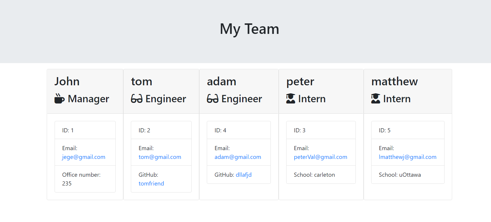
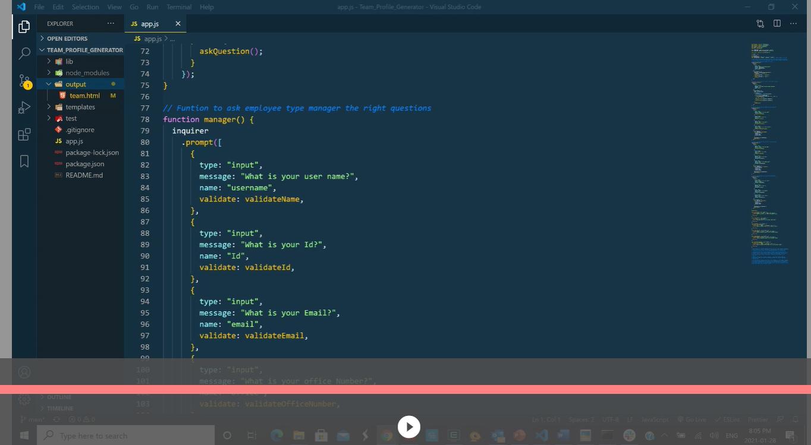

# Team_Profile_Generator

## How to use

Run node index.js and answer the question. A team.html will ge generated

## Video
Click on Image to play the video

The gif was too large so it was compressed you will have to watch the Mp4 to see how it works properly.

The Mp4 file is in images/team_video.mp4

## Team Profile file

The generated team profile file is called team.html

[A generated team profile file](output/team.html)
